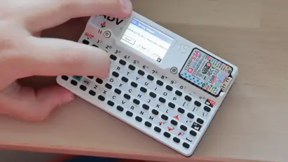
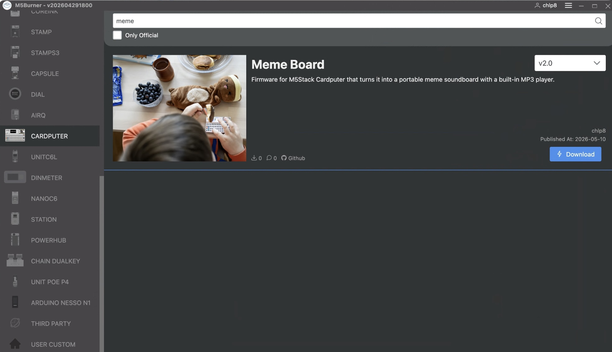

# How I built a MEME BOARD on ESP32-S3: an AI-assisted embedded development experience

I unexpectedly built myself a MEME BOARD. Here it is:


[](https://youtu.be/Ai2DBcBQq6E)

Video demo: <https://youtu.be/Ai2DBcBQq6E>

It is a small standalone embedded console based on the M5Stack Cardputer ADV with a screen, keyboard, SD card, and speaker. The device plays meme sounds when you press keys and shows images. As a bonus — a polyphonic piano on the keyboard and a mini MP3 player.

Here is the project on GitHub [https://github.com/chlp/meme-board](https://github.com/chlp/meme-board) and on M5Burner (the official M5Stack app for flashing devices) — there you can find it by the name **Meme Board**.



While working on this project, I once again felt two important things about AI-assisted development, this time on the example of an embedded device:

1. AI writes code much better when it has a working reference of a real project for the specific hardware, not just documentation and an API.
2. AI starts being truly useful when it can independently run the full cycle on its own: change the code → build → flash → run → read logs → analyze the result.

Without that, my embedded development is too slow even with AI's help.

---

I had an idea — to build an internet radio, but not just a simple web app, with a hardware embodiment. The backend was, of course, the easiest part for me (since I'm a backend engineer). Claude handled the frontend pretty fast too — it writes JS code well, including custom players that send and receive audio over WebSocket. The radio worked across several browsers fairly quickly.

Then I moved on to the hardware. As a starting point I bought two devices to try at once — the M5Stack Cardputer ADV and the CoreS3 Lite.

### [M5Stack CoreS3 Lite](https://shop.m5stack.com/products/m5stack-cores3-lite-esp32s3-iot-dev-kit) — ~$45


| | |
|---|---|
| **CPU** | ESP32-S3, dual-core Xtensa LX7 @ 240 MHz |
| **RAM / Flash** | 8 MB PSRAM / 16 MB |
| **Display** | 2.0" IPS touchscreen, 320×240 |
| **Camera** | 0.3 MP |
| **Audio** | 1W speaker, 2 microphones |
| **Power** | 200 mAh LiPo |
| **Size** | 54×54×16.5 mm |

More RAM, a camera, two microphones — oriented toward multimedia and voice tasks. I started with this one: it seemed like the two microphones would help with two-way audio for streaming.

### [M5Stack Cardputer ADV](https://shop.m5stack.com/products/m5stack-cardputer-adv-version-esp32-s3) — ~$30


| | |
|---|---|
| **CPU** | ESP32-S3FN8, dual-core Xtensa LX7 @ 240 MHz |
| **Flash** | 8 MB (no external PSRAM; 512 KB of internal SRAM) |
| **Display** | 1.14" LCD, 240×135 |
| **Keyboard** | 56 keys |
| **Audio** | 1W speaker, microphone, 3.5mm jack |
| **Power** | 1750 mAh LiPo |
| **Size** | 84×54×19.6 mm, 81 g |

A compact pocket computer with a full QWERTY keyboard, a large battery, and microSD. The final device for the meme-board.

---

And here I realized that Claude Code handles hardware much worse than the web. Maybe I just got unlucky with this particular task on this particular device, but it was hard for AI to work with M5Stack. At first it was very hard for it to draw a normal working user interface for me, but the real difficulties came with audio playback. Constant wheezing, latency, residual echo.

I struggled like this for several days and realized I should start with a simpler task. Plus I wanted to play around with the second device. I came up with the idea of building a piano on the keyboard, then an MP3 player — and that gradually grew into a meme-board with sounds and images.

While figuring it out, I went through firmware examples from other authors for M5Stack devices. I found several examples with great audio quality. I thought: if I find a working example and give it to Claude — it will figure out what's different from my implementation. I downloaded git repositories of several such third-party firmwares and asked Claude to figure out how they handle MP3 decoding, glitch-free audio playback, and CPU usage. Only after that did it identify the difference between what it was trying to do and what was done there. In the end, this one helped me — https://github.com/bomberman30/AdvanceOS-for-cardputer.

It turned out the problem was not only with MP3 decoding itself, but with the organization of the entire audio pipeline. Working projects for the Cardputer used a more careful approach to I2S audio, buffering, and load distribution between tasks. On ESP32-S3 this turned out to be critical: incorrect organization of SD card reads and feeding data to audio led to wheezing, underruns, and hangs.

There turned out to be several specific solutions.

First — **task architecture**: audio decoding is pinned to a separate core (core 0 of the two available at 240 MHz) with priority 2 and a 20 KB stack ([`audio.cpp`](https://github.com/chlp/meme-board/blob/main/src/audio.cpp)), while the UI runs on core 1 — they don't interfere with each other.

Second — **triple buffering** instead of double: M5Unified keeps a queue of two slots (current + next), so with double buffering one of the buffers is being overwritten directly during playback through DMA — hence the characteristic constant wheezing. Three buffers solved the problem. Each buffer is 1536 int16 values, i.e. 768 stereo frames ≈ 17 ms at 44 100 Hz; the triple queue gives ~52 ms of headroom before the first underrun ([`AudioOutputM5Speaker.h`](https://github.com/chlp/meme-board/blob/main/src/AudioOutputM5Speaker.h)).

Third — **Watchdog**: by default, the ESP32 reboots after 5 seconds if the IDLE0 task starves — which is inevitable when the audio task takes up the whole core. I had to explicitly disable that WDT and subscribe the audio task to its own watchdog reset, so that an accidentally hung decoder would still be caught, but there would be no false positives.

Once I applied the same approach, mine started working. There were another dozen iterations to make sure it didn't hang or reboot. I learned to write structured logs to the serial monitor ([`log.h`](https://github.com/chlp/meme-board/blob/main/src/log.h)), so that errors were traceable and provided information for debugging. To speed up iterations, I taught Claude to independently run almost the full embedded development loop:

- build the firmware;
- update the device;
- read serial logs;
- analyze errors;
- perform actions on the device;
- listen to the result through the computer's microphone.

After that, the speed of experiments increased many times over.

---

A few interesting additional things I managed to do for the project.

The Cardputer has only 8 MB of flash for firmware and 512 KB of internal SRAM (with no external PSRAM), so images and music are stored on the SD card. Pulling it out every time to update files seemed inconvenient to me, and it would have limited Claude's ability to work independently. So I taught the firmware to accept commands over USB serial directly on the running device ([`sd_serial_xfer.cpp`](https://github.com/chlp/meme-board/blob/main/src/sd_serial_xfer.cpp)) — to read and write files on the SD card without physically removing it. For this, [`sd_xfer.py`](https://github.com/chlp/meme-board/blob/main/tools/sd_xfer.py) was written:

```
$ python3 tools/sd_xfer.py -p /dev/tty.usbmodem201101 ls /boards/meme
F	/boards/meme/a.mp3	30111
F	/boards/meme/a.jpg	8542
F	/boards/meme/b.mp3	24350
F	/boards/meme/b.jpg	7918
...

$ python3 tools/sd_xfer.py -p /dev/tty.usbmodem201101 put boom.mp3 /boards/meme/a.mp3
  [██████████████████████████████] 100%  29.4 KB / 29.4 KB
```

As a plus — future imaginary customers, when connected via USB, can use this function to service the device: upload music, images, sounds.

Claude also helped me find free MP3 music for the repository, sounds and images for memes — and trim them. It also picked the parameters and format for audio: the SD card reader works through SPI, not SDIO, so read speed is limited. I had to find a compromise between file size, bitrate, and playback stability — too high a bitrate caused dropouts, because reading from microSD and decoding ran into the bus bandwidth. I combined the utilities for writing to the card and conversion into a single step ([`sync_sd_card_content.sh`](https://github.com/chlp/meme-board/blob/main/tools/sync_sd_card_content.sh) calls [`normalize_mp3.sh`](https://github.com/chlp/meme-board/blob/main/tools/normalize_mp3.sh) before syncing) — files are prepared and updated together with the firmware.

---

In the end, the project turned out to be much more interesting for me than a typical pet project.

AI does significantly speed up development — especially backend, frontend, and routine automation. But embedded for now remains a completely different area. Here it is not enough just to "know the documentation". A lot depends on the specific implementation for the specific hardware — and there are clearly fewer ready training examples for AI on niche devices than for the web.

The most interesting thing is that AI did manage to help me reach a working result. But only after two things: when I gave it a good working example, and when it got the ability to independently run the cycle of testing and fixing. After that, it started to feel not like a code generator, but like a very fast junior embedded engineer who can run a huge number of iterations and quickly learns from working examples.

Development has become much more accessible, even in areas where you're not deeply involved. The result comes faster than the weekend ends and the interest fades.

I haven't dropped the internet radio with M5Stack CoreS3: while working on the Meme Board I figured out the quirks of the hardware and got working code on a smaller task, so now I feel ready to come back to the internet radio idea.
