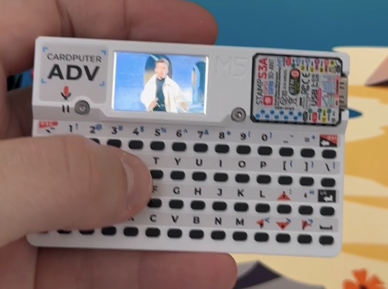
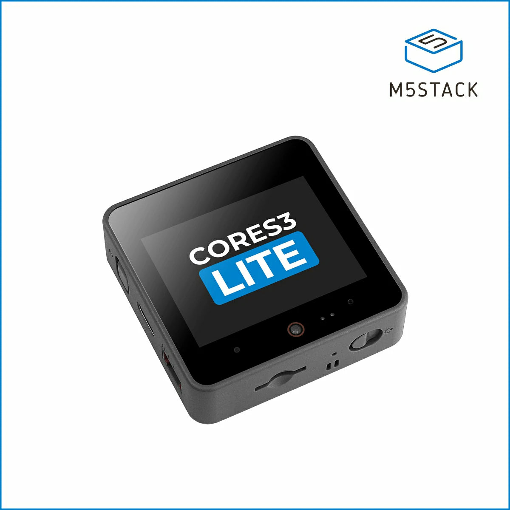
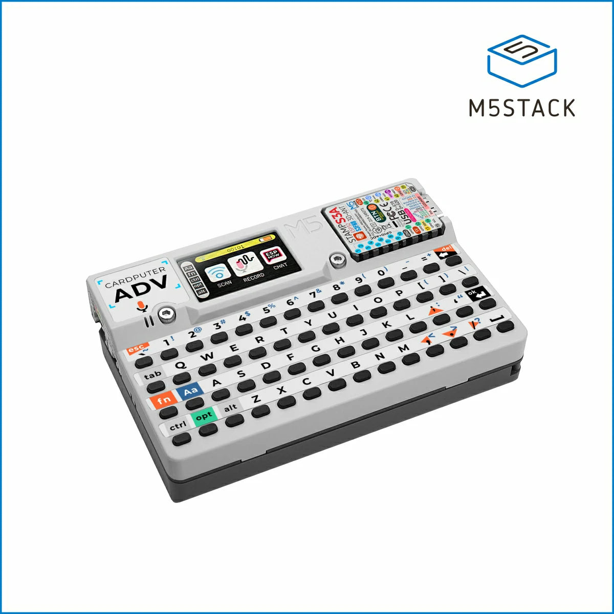

# Как я сделал MEME BOARD на ESP32-S3: опыт AI-assisted embedded разработки

Я внезапно для себя сделал MEME BOARD. Вот он:

Это небольшая standalone embedded-консоль на базе M5Stack Cardputer ADV с экраном, клавиатурой, SD-картой и динамиком. Устройство запускает мемные звуки по нажатию клавиш и показывает картинки. В качестве бонуса — полифоническое пианино на клавиатуре и мини-MP3-плеер.

Вот проект в GitHub [https://github.com/chlp/cardputer-meme-board](https://github.com/chlp/cardputer-meme-board) и в M5Burner (официальное приложение M5Stack для прошивки устройств).

### [M5Stack CoreS3 Lite](https://shop.m5stack.com/products/m5stack-cores3-lite-esp32s3-iot-dev-kit) — ~$45

| | |
|---|---|
| **CPU** | ESP32-S3, dual-core Xtensa LX7 @ 240 MHz |
| **RAM / Flash** | 8 MB PSRAM / 16 MB |
| **Дисплей** | 2.0" IPS touchscreen, 320×240 |
| **Камера** | 0.3 MP |
| **Аудио** | 1W speaker, 2 микрофона |
| **Питание** | 200 mAh LiPo |
| **Размер** | 54×54×16.5 мм |

Более мощный вариант, с которого начинался проект. Больше RAM, камера, два микрофона — ориентирован на мультимедиа и голосовые задачи.

---

### [M5Stack Cardputer ADV](https://shop.m5stack.com/products/m5stack-cardputer-adv-version-esp32-s3) — ~$30

| | |
|---|---|
| **CPU** | ESP32-S3FN8, dual-core Xtensa LX7 @ 240 MHz |
| **Flash** | 8 MB |
| **Дисплей** | 1.14" LCD, 240×135 |
| **Клавиатура** | 56 клавиш |
| **Аудио** | 1W speaker, микрофон, 3.5mm jack |
| **Питание** | 1750 mAh LiPo |
| **Размер** | 84×54×19.6 мм, 81 г |

Итоговое устройство для meme-board. Компактный карманный компьютер с полноценной QWERTY-клавиатурой, большой батареей и microSD.

Пока делал этот проект, я ещё раз прочувствовал две важные вещи про AI-assisted разработку, в этот раз на примере embedded-устройства:

1. AI гораздо лучше пишет код, когда у него есть рабочий референс реального проекта под конкретную железку, а не только документация и API.
2. AI начинает быть действительно полезным, когда может самостоятельно проходить полный цикл:
изменение кода → сборка → прошивка → запуск → чтение логов → анализ результата.

Без этого моя embedded-разработка слишком медленная даже с помощью AI.

Как это вышло? Была идея — сделать интернет-радио, но не простое веб-приложение, а с железным воплощением. С бек-эндом мне конечно же оказалось легче всего (ведь я бек-энд инженер). С фронтом Claude справился тоже достаточно быстро — он хорошо пишет JS-код, включая кастомные плееры с передачей-приёмкой звука по WebSocket. Радио достаточно быстро заработало в нескольких браузерах. Далее я приступил к железке. В качестве основы купил попробовать сразу 2 девайса — M5Stack Cardputer ADV и CoreS3 Lite. И тут я понял, что Claude Code гораздо хуже справляется с железками. Начал я с CoreS3, т.к. больше памяти и 2 микрофона, что должно было помочь с двусторонней передачей звука для стриминга. То ли мне так повезло с конкретной задачей под конкретную железку, но AI и интерфейс было очень сложно рисовать, и хуже всего он справлялся с воспроизведением звука. Постоянные хрипы, запаздывания, остаточное эхо. Так я провозился несколько дней и понял, что надо начать с задачки попроще. Плюс хотелось поиграться со вторым устройством. Придумал сделать пианино на клавиатуре, MP3-плеер, потом это вылилось в meme-board со звуками и картинками. CoreS3 я не забросил — за это время разобрался с особенностями железки и получил рабочий код на задаче поменьше, так что теперь чувствую себя готовым вернуться к идее интернет-радио.

Я настроил много инструментов и скриптов для сборки, конвертации медиафайлов, синхронизации — под macOS и Windows. С железками дела шли хуже всего. По serial monitor было видно, что Claude следовал официальной документации и примерам, но результат оставался неприемлемым. При этом я встречал примеры других проектов с отличным качеством звука, и подумал: если найти рабочий пример и дать его Claude — он разберётся в разнице. Мне пришлось самому перебрать десяток разных прошивок, пока не нашёл ту, у которой устраивало качество работы. Когда нашёл нужную, выкачал её git-репозиторий и попросил Claude разобраться, как она работает с декодированием MP3, с воспроизведением звука без шипения, как использует процессор. Только после этого он определил разницу между тем, что пытался сделать, и тем, что сделано здесь.

Оказалось, что проблема была не только в самом декодировании MP3, а в организации всего audio pipeline. Рабочие проекты под Cardputer использовали более аккуратную работу с I2S-аудио, буферизацией и распределением нагрузки между задачами. На ESP32-S3 это оказалось критично: неправильная организация чтения с SD-карты и подачи данных в аудио приводила к хрипам, underrun'ам и подвисаниям.

Конкретных решений оказалось несколько. Первое — **архитектура задач**: аудиодекодирование закреплено на отдельном ядре (core 0 из двух доступных по 240 МГц), пока UI работает на core 1 — они не мешают друг другу. Второе — **тройная буферизация** вместо двойной: M5Unified держит очередь из двух слотов (текущий + следующий), поэтому при двойной буферизации один из буферов перезаписывается прямо во время воспроизведения через DMA — отсюда характерный постоянный хрип. Три буфера решили проблему. Третье — **Watchdog**: по умолчанию ESP32 перезагружается через 5 секунд, если задача IDLE0 голодает, что неизбежно, когда аудиозадача занимает всё ядро. Пришлось явно отключить этот WDT и подписать аудиозадачу на собственный watchdog-сброс — чтобы случайный зависший декодер всё равно поймали, но ложных срабатываний не было.

Сделав себе такой же подход, у меня заработало. Был ещё десяток итераций, чтобы не подвисало и не перезагружалось. Я научился писать структурированные логи в serial monitor, чтобы ошибки были отслеживаемыми и давали информацию для отладки. Чтобы ускорить итерации, я научил Claude самостоятельно проходить почти полный embedded development loop:

- собирать прошивку;
- обновлять устройство;
- читать serial logs;
- анализировать ошибки;
- выполнять действия на устройстве;
- слушать результат через микрофон компьютера.

После этого скорость экспериментов выросла в разы.

Несколько интересных дополнительных вещей, которые удалось сделать для проекта:

Cardputer имеет всего 8 МБ flash-памяти под прошивку (оперативная память — 512 КБ SRAM), поэтому картинки и музыка хранятся на SD-карте. Каждый раз вытаскивать её с целью обновить файлы мне показалось неудобным, и это бы ограничило возможности самостоятельной работы Claude. Поэтому я научил прошивку принимать команды через USB serial прямо на работающем устройстве: `SD> ls /path`, `SD> put filename.mp3 /boards/meme/a.mp3`, `SD> rm /old.mp3` — читать и записывать файлы на SD-карту без физического извлечения. Как плюс — будущие воображаемые клиенты, подключив по USB, могут через эту функцию обслуживать устройство: закачать музыку, картинки, звуки.

Ещё из интересного — Claude помог найти бесплатную музыку в MP3, которую можно положить в репозиторий, а также звуки и картинки для мемов и обрезать их.

Он же подобрал наиболее подходящие параметры и формат для звуков и музыки, а также запустил утилиты конвертации. Модуль чтения с SD-карты работает через SPI, а не SDIO, поэтому скорость чтения ограничена. Пришлось подбирать компромисс между размером файлов, bitrate и стабильностью воспроизведения — слишком высокий bitrate приводил к пропускам аудио, потому что чтение с microSD и декодирование упирались в пропускную способность шины.

Я объединил утилиты записи на карту и конвертации. Файлы подготавливаются и обновляются за один шаг, можно выполнять вместе с обновлением прошивки.

Фактически проект превратился не только в MEME BOARD, но и в исследование того, как на маленьком ESP32-S3 устройстве правильно организовать:

- потоковое воспроизведение MP3;
- чтение файлов с SD-карты;
- буферизацию аудио;
- работу UI одновременно со звуком;
- обновление контента без физического извлечения карты памяти;
- автоматизацию цикла прошивки и тестирования.

В итоге проект оказался для меня гораздо интереснее обычного pet project.

С одной стороны, AI действительно сильно ускоряет разработку. Особенно backend, frontend и автоматизацию рутины вокруг проекта. Claude отлично справлялся с генерацией JS-кода, утилитами конвертации, подготовкой медиафайлов, автоматизацией сборки и даже поиском подходящих ресурсов.

Но embedded-разработка пока остаётся совсем другой областью. Здесь недостаточно просто "знать документацию". Очень многое зависит от конкретной реализации: как организованы буферы, как читается SD-карта, как работает audio pipeline, как распределяется нагрузка между задачами и насколько удачно подобраны параметры под конкретную железку. Возможно, ещё причина в том, что под отдельно взятые железки обучающих примеров для ИИ недостаточно, или что общие подходы под современные процессоры и ОС не совсем применимы к embedded — но AI пытается их использовать.

Самое интересное, что AI всё же смог помочь мне дойти до рабочего результата. Но только после двух вещей:

- когда я дал ему хороший рабочий пример;
- и когда он получил возможность самостоятельно проходить цикл тестирования и исправлений.

После этого он стал ощущаться уже не как генератор кода, а скорее как очень быстрый junior embedded engineer, который умеет проводить огромное количество итераций и быстро учится на рабочих примерах.

И, честно говоря, это главное, что я вынес из проекта: разработка стала гораздо доступнее, даже в областях, где ты не сильно углублён. Результат приходит быстрее, чем заканчиваются выходные и пропадает интерес.
